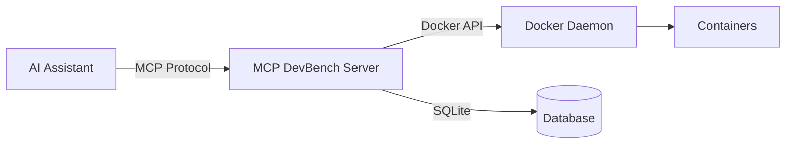

# API Overview

This document provides an overview of the MCP DevBench API.

## API Architecture

MCP DevBench implements the [Model Context Protocol (MCP)](https://modelcontextprotocol.io/) specification, providing a standardized way for AI assistants to interact with Docker containers.



## Protocol Versions

- **MCP Version:** 1.0
- **API Version:** 1.0.0

## Transport Modes

MCP DevBench supports three transport modes:

### stdio (Default)

Standard input/output transport for MCP clients:

```bash
uv run python -m mcp_devbench.server
```

**Use cases:**
- Local development
- MCP client applications
- Direct integration

### SSE (Server-Sent Events)

HTTP-based server-sent events:

```bash
export MCP_TRANSPORT_MODE=sse
export MCP_HOST=0.0.0.0
export MCP_PORT=8000
uv run python -m mcp_devbench.server
```

**Use cases:**
- Web applications
- Browser-based clients
- Real-time updates

### HTTP (Streamable)

Full HTTP transport with streaming support:

```bash
export MCP_TRANSPORT_MODE=streamable-http
export MCP_HOST=0.0.0.0
export MCP_PORT=8000
uv run python -m mcp_devbench.server
```

**Use cases:**
- Production deployments
- REST-like access
- Load balancing

## API Components

### Tools

MCP tools are the primary API methods:

| Tool | Category | Purpose |
|------|----------|---------|
| `spawn` | Container | Create a new container |
| `attach` | Container | Attach client to container |
| `kill` | Container | Stop and remove container |
| `list` | Container | List all containers |
| `exec_start` | Execution | Start command execution |
| `exec_poll` | Execution | Poll for command output |
| `exec_signal` | Execution | Send signal to execution |
| `fs_read` | Filesystem | Read file contents |
| `fs_write` | Filesystem | Write file contents |
| `fs_delete` | Filesystem | Delete file or directory |
| `fs_list` | Filesystem | List directory contents |

See [MCP Tools Reference](tools.md) for detailed documentation.

### Resources

MCP resources provide read access to container data:

- `workspace://{container_id}/` - Container workspace root
- `logs://{container_id}/` - Container logs
- `stats://{container_id}` - Container statistics

### Prompts

Pre-defined workflows:

- `setup_python` - Setup Python development environment
- `setup_node` - Setup Node.js development environment
- `run_tests` - Run test suite

## Request/Response Format

### Request

```json
{
  "jsonrpc": "2.0",
  "id": "request-1",
  "method": "tools/call",
  "params": {
    "name": "spawn",
    "arguments": {
      "image": "python:3.11-slim",
      "persistent": false
    }
  }
}
```

### Response

```json
{
  "jsonrpc": "2.0",
  "id": "request-1",
  "result": {
    "container_id": "c_abc123...",
    "status": "running",
    "alias": null
  }
}
```

### Error Response

```json
{
  "jsonrpc": "2.0",
  "id": "request-1",
  "error": {
    "code": -32000,
    "message": "Image not allowed",
    "data": {
      "image": "malicious:latest",
      "allowed_images": ["python:3.11-slim", "node:18-slim"]
    }
  }
}
```

## Data Types

### Container ID

Opaque identifier for containers:

```
Format: c_{uuid}
Example: c_123e4567-e89b-12d3-a456-426614174000
```

### Execution ID

Opaque identifier for command executions:

```
Format: e_{uuid}
Example: e_987fcdeb-51a2-43f9-b345-98765432100
```

### Timestamps

ISO 8601 format with timezone:

```
Example: 2024-01-15T10:30:00.123Z
```

### File Paths

Absolute paths within workspace:

```
Valid: /workspace/file.txt
Valid: /workspace/subdir/file.txt
Invalid: /etc/passwd
Invalid: ../../../etc/passwd
```

## Rate Limiting

No rate limiting by default. For production deployments, use a reverse proxy:

```nginx
limit_req_zone $binary_remote_addr zone=api:10m rate=10r/s;

location / {
    limit_req zone=api burst=20 nodelay;
    proxy_pass http://mcp-devbench:8000;
}
```

## Pagination

For operations returning lists:

```json
{
  "page": 1,
  "per_page": 50,
  "total": 123
}
```

## Versioning

API version is included in server capabilities:

```json
{
  "protocolVersion": "1.0",
  "capabilities": {
    "tools": {},
    "resources": {},
    "prompts": {}
  },
  "serverInfo": {
    "name": "mcp-devbench",
    "version": "1.0.0"
  }
}
```

## Status Codes

HTTP status codes (HTTP transport only):

| Code | Meaning |
|------|---------|
| 200 | Success |
| 400 | Bad Request |
| 401 | Unauthorized |
| 403 | Forbidden |
| 404 | Not Found |
| 429 | Too Many Requests |
| 500 | Internal Server Error |
| 503 | Service Unavailable |

## CORS

CORS headers for browser access:

```bash
MCP_CORS_ENABLED=true
MCP_CORS_ORIGINS=https://example.com,https://app.example.com
```

## WebSocket Support

WebSocket upgrade for real-time communication (planned):

```javascript
const ws = new WebSocket('ws://localhost:8000/ws');
ws.onmessage = (event) => {
  const message = JSON.parse(event.data);
  console.log('Received:', message);
};
```

## Client Libraries

### Python

```python
from mcp import Client

async with Client("python -m mcp_devbench.server") as client:
    result = await client.call_tool("spawn", {
        "image": "python:3.11-slim"
    })
    print(result)
```

### JavaScript/TypeScript

```typescript
import { Client } from '@modelcontextprotocol/sdk';

const client = new Client({
  command: 'python',
  args: ['-m', 'mcp_devbench.server']
});

await client.connect();
const result = await client.callTool('spawn', {
  image: 'python:3.11-slim'
});
```

## Best Practices

### Idempotency

Use idempotency keys for operations that create resources:

```json
{
  "image": "python:3.11-slim",
  "idempotency_key": "unique-key-123"
}
```

### Error Handling

Always handle errors gracefully:

```python
try:
    result = await client.call_tool("spawn", {...})
except MCPError as e:
    if e.code == -32000:  # Application error
        print(f"Error: {e.message}")
    elif e.code == -32601:  # Method not found
        print("Tool not supported")
    else:
        raise
```

### Timeouts

Set appropriate timeouts:

```python
# Short operations
await client.call_tool("fs_read", {...}, timeout=30)

# Long operations
await client.call_tool("exec_start", {...}, timeout=300)
```

### Retries

Implement exponential backoff for retries:

```python
import asyncio
from tenacity import retry, stop_after_attempt, wait_exponential

@retry(
    stop=stop_after_attempt(3),
    wait=wait_exponential(multiplier=1, min=4, max=10)
)
async def spawn_with_retry(...):
    return await client.call_tool("spawn", ...)
```

## Performance

### Warm Pool

Enable warm container pool for faster provisioning:

```bash
MCP_WARM_POOL_ENABLED=true
MCP_WARM_POOL_SIZE=5
```

### Connection Pooling

Reuse client connections:

```python
# ✅ Good - Reuse client
client = Client(...)
await client.connect()

for i in range(10):
    await client.call_tool(...)

await client.disconnect()

# ❌ Bad - New client each time
for i in range(10):
    async with Client(...) as client:
        await client.call_tool(...)
```

### Batching

Batch operations when possible:

```python
# Execute multiple operations
async with asyncio.TaskGroup() as group:
    task1 = group.create_task(client.call_tool("fs_read", {...}))
    task2 = group.create_task(client.call_tool("fs_read", {...}))
    task3 = group.create_task(client.call_tool("fs_read", {...}))

results = [task1.result(), task2.result(), task3.result()]
```

## Next Steps

- **[MCP Tools Reference](tools.md)** - Detailed tool documentation
- **[Authentication](authentication.md)** - Authentication methods
- **[Error Handling](errors.md)** - Error codes and handling
- **[Security](../guide/security.md)** - Security best practices
