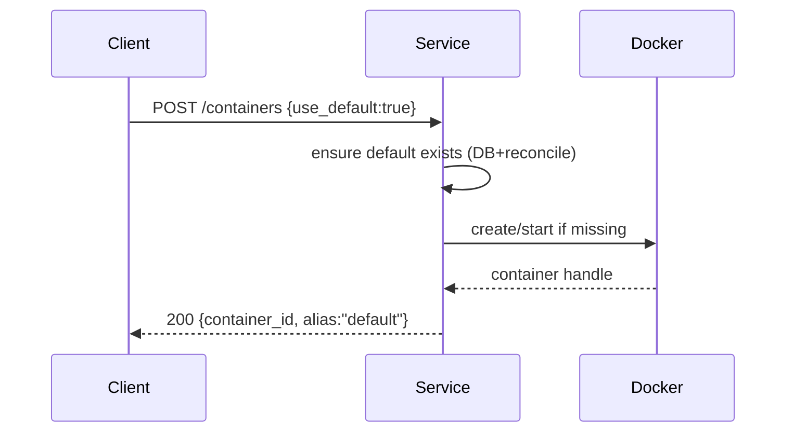
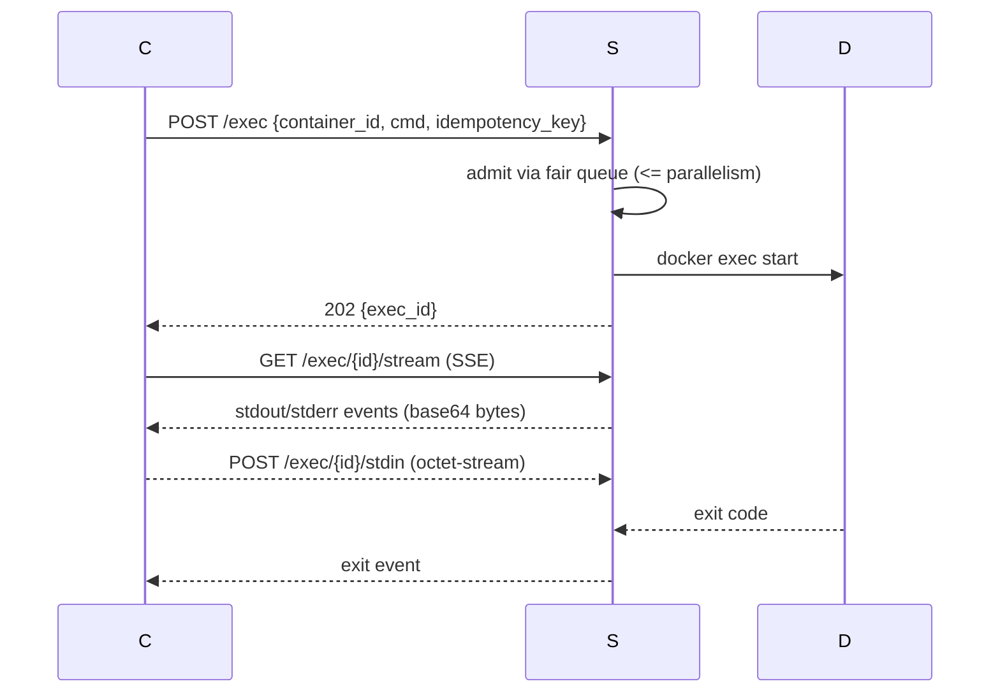
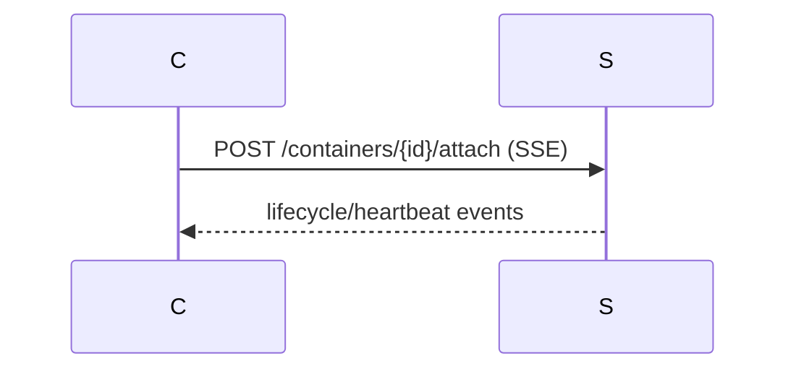
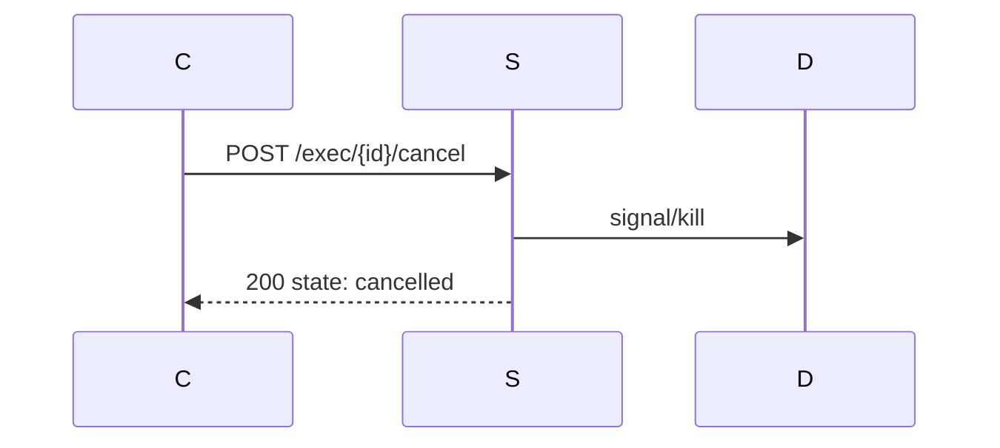
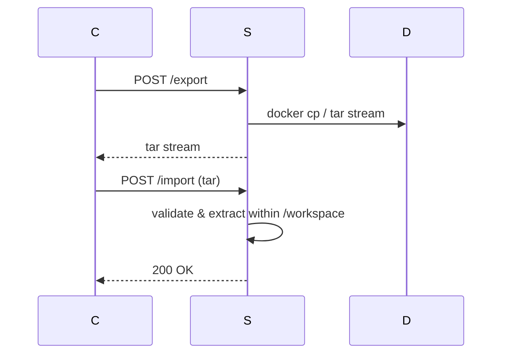
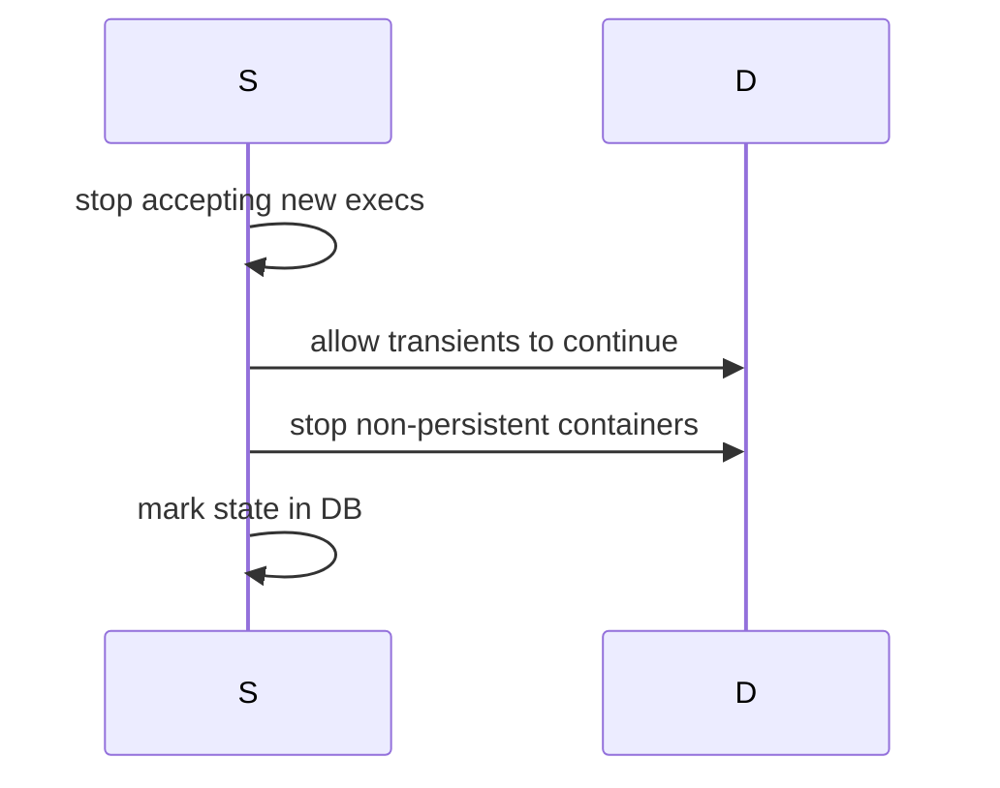
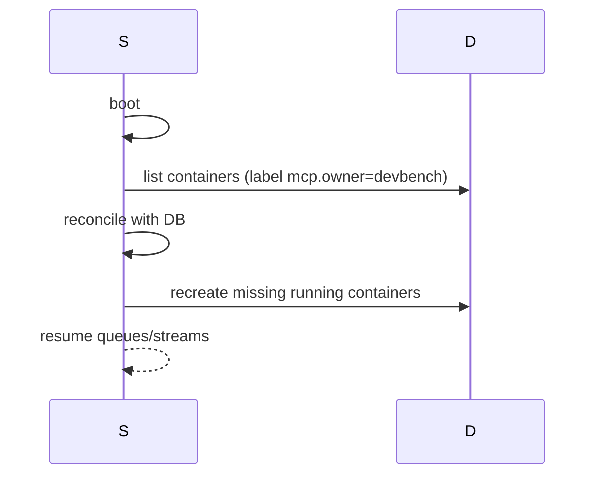

# MCP Devbench — Single‑Host Container Runtime & Tooling

**Lane:** C (design‑required)  
**Scope:** Medium  
**Profile:** Thinking  
**Canonical ticket:** https://github.com/pvliesdonk/mcp-devbench/issues/8

> This document specifies the external interfaces, runtime behaviors, persistence model, security posture, and observability for the single‑host Docker‑backed execution service used by MCP devbench. It also includes a milestone‑ordered work breakdown and sequence diagrams. Where product requirements were ambiguous, we list options with pros/cons and propose a default.

---

## 1. Goals & Non‑Goals

### Goals
- Opaque `container_id` with optional user aliases; multiple clients can attach to the same container.
- A single warm **default container** (Ubuntu LTS image by tag) per host; configurable; allow‑list of images/registries; opt‑in pin‑to‑digest.
- Docker **single‑host runtime**; images are bare; run **non‑root** by default; per‑exec `as_root` flag (policy‑gated, UID 0).
- Storage: **transient** FS by default; optional **persistent volume** mounted at `/workspace`; export/import (tar); direct file ops; **MCP ROOTS** scope to `/workspace` only.
- Durability: **SQLite** state store; **boot reconciliation**; **no idle timeout**; **7‑day orphan GC**; transient containers die on graceful shutdown only; survive crashes and are restored.
- Transport: **streamable HTTP**; optional **SSE**; polling fallback.
- Auth track: none → bearer → OAuth 2.1 (Authelia example).
- Exec: **asynchronous**, default **parallelism=4** per container (configurable); cancel; **idempotency keys**; fairness/backpressure.
- Identity & FS safety: accept `client_name` + `session_id`; `fs.write` supports **etag**; conflicts reported.
- Config: **ENV‑first** (YAML later). Observability: **structured audit logs** + **basic metrics**.
- Error taxonomy: `InvalidArgument, NotAllowed, NotFound, Conflict, ResourceExhausted, DeadlineExceeded, Internal, Unavailable, Cancelled`.

### Non‑Goals
- Kubernetes orchestration (future adapter only).
- Multi‑host scheduling.
- Mounting privileged sockets (e.g., host Docker socket) into workloads.

---

## 2. External Interface (HTTP API)
Transport defaults to HTTP/1.1 with chunked transfer; SSE where noted. All responses are JSON unless streaming.

### 2.1 Resources & Methods

#### POST `/containers` — Spawn or get warm default
Creates a new container or returns the warm default when `use_default=true`.

**Request**
```json
{
  "use_default": true,
  "alias": "team-default", 
  "image": "ubuntu:22.04", 
  "pin_digest": false,
  "persistent": false,
  "env": {"TZ": "UTC"},
  "client": {"client_name": "cli", "session_id": "s-123"}
}
```
**Response**
```json
{
  "container_id": "ctr_91d7a7d3f3d243ccb1ec", 
  "alias": "team-default",
  "image": {"name": "ubuntu:22.04", "resolved": "ubuntu@sha256:..."},
  "state": "running",
  "persistent": false,
  "workspace_mount": "/workspace",
  "created_at": "2025-10-24T09:10:00Z"
}
```

#### GET `/containers/{id}` — Inspect
Returns current container state.

#### POST `/containers/{id}/attach` — Attach container event stream
Upgrades to **SSE** for container‑level events (lifecycle, health, logs if enabled). **Does not** carry exec I/O.

#### POST `/exec` — Start an exec
Starts a new exec within a container.

**Request**
```json
{
  "container_id": "ctr_91d7...", 
  "cmd": ["bash", "-lc", "python -V"],
  "cwd": "/workspace", 
  "env": {"PYTHONWARNINGS": "ignore"},
  "stdin": false,
  "as_root": false,
  "idempotency_key": "exec:e0f2c6",
  "client": {"client_name": "webui", "session_id": "sess-9"}
}
```
**Response**
```json
{
  "exec_id": "exe_6a5f...",
  "container_id": "ctr_91d7...",
  "state": "starting",
  "started_at": "2025-10-24T09:12:31Z"
}
```

#### GET `/exec/{id}/stream` — Stream exec output
SSE stream (`stdout`/`stderr`/`exit`) or long‑poll fallback with `?poll=1&cursor=...`. Server enforces per‑container parallelism and fair scheduling.

SSE data**: raw base64‑encoded bytes of the stream chunk (e.g., `SEVMTE8\n` for `HELLO\n`
). No JSON wrapper. Metadata (`exec_id`, `seq`, `ts`) is placed in SSE `id:` and `event:` fields and/or a separate retryable header.

#### POST `/exec/{id}/stdin` — Send exec input
`Content-Type: application/octet-stream` with chunk framing. Returns `204`.

#### POST `/exec/{id}/cancel` — Cancel exec
Transition to `Cancelled` if possible; idempotent.

#### POST `/fs/read` — Read file
```json
{"container_id": "ctr_...", "path": "/workspace/README.md", "offset": 0, "limit": 1048576}
```
**Response**
```json
{"etag": "W/\"b64sha1:...\"", "data_b64": "IyBSRUFETUUuLi4=", "mod_time": "2025-10-24T09:00:00Z"}
```

#### POST `/fs/write` — Write with etag
```json
{
  "container_id": "ctr_...", "path": "/workspace/app.py",
  "expect_etag": "W/\"b64sha1:...\"", 
  "data_b64": "cHJpbnQoJ0hpJyk=",
  "mode": 420
}
```
**Conflicts** return `409 Conflict` with taxonomy `Conflict` when `expect_etag` mismatches.

#### POST `/fs/list` — Directory listing
```json
{"container_id": "ctr_...", "path": "/workspace", "recursive": false}
```

#### POST `/export` — Export workspace as tar
```json
{"container_id": "ctr_...", "include_dotfiles": true}
```
**Response**: `application/x-tar` stream.

#### POST `/import` — Import tarball into workspace
`Content-Type: application/x-tar`. Rejects paths outside `/workspace`.

#### POST `/containers/{id}/stop` — Graceful shutdown
Stops but does not delete persistent data. Transients terminate only on **graceful service shutdown**, not idle.

#### DELETE `/containers/{id}` — Delete container
Immediate removal; persistent volume may be retained if flagged.

---

## 3. Concurrency, Streaming & Fairness

- **Per‑container exec parallelism**: default **4**; configurable via `MCP_EXEC_PARALLELISM`. Excess execs are **queued and scheduled using a fair‑share algorithm across clients** (see §13).
- **Fairness**: Weighted fair queuing by `(client_name, session_id)` with per‑client concurrency cap.
- **Backpressure**: When output buffers exceed `MCP_STREAM_BACKLOG_BYTES` (default 8 MiB), throttle producer, then pause reads; if sustained, abort with `ResourceExhausted`.
- **Streaming**: Prefer SSE. Each event carries `exec_id`, `seq`, `ts`. Heartbeats every 5s. Poll fallback with cursors.
- **Idempotency**: `idempotency_key` deduplicates `POST /exec`. If a matching key exists within `MCP_IDEMP_TTL` (default 10m), return the original `exec_id`.

---

## 4. Filesystem Consistency & Safety

- **Roots**: All direct file APIs and tar import/export are scoped to `/workspace`. Paths are normalized and verified; symlink traversal is constrained to remain within root.
- **ETags**: `fs.read` returns a weak ETag computed from size+mtime+hash; `fs.write` may include `expect_etag`. On mismatch → `Conflict`.
- **Locks**: **Cross‑process advisory locks via SQLite only (per connection)**. Writers acquire a row in `files_locks` using `INSERT` (unique `path`); failure to insert implies contention → retry/backoff. A **per‑process in‑memory hint cache** may exist for fast uncontended paths, but it is non‑authoritative and best‑effort; the DB lock is the source of truth.
- **Non‑root by default**: Container user `uid=1000,gid=1000`; `as_root=true` requires policy allow.

---

## 5. Image Resolution & Pull Secrets

- **Allow‑lists**: `MCP_IMAGE_ALLOW` (comma‑sep list of `repo[:tag]` glob patterns). `MCP_REGISTRY_ALLOW` for registries.
- **Pinning**: `pin_digest=true` resolves tag → digest at start, records `resolved` in state. Default **off**.
- **Pull secrets**: From Docker config (per host) or `MCP_REGISTRY_AUTH_JSON` (base64 docker‑config JSON). Secrets are used only for pulls.
- **Bare images**: No host mounts besides `/workspace` volume when persistent.

---

## 6. Persistence & Durability (SQLite)

### 6.1 Schema
```sql
CREATE TABLE containers (
  container_id TEXT PRIMARY KEY,
  alias TEXT,
  image_name TEXT NOT NULL,
  image_resolved TEXT,
  persistent INTEGER NOT NULL DEFAULT 0,
  state TEXT NOT NULL, -- creating|running|stopped|deleted
  created_at TEXT NOT NULL,
  updated_at TEXT NOT NULL,
  last_seen TEXT,
  orphan_after TEXT
);

CREATE UNIQUE INDEX idx_alias ON containers(alias) WHERE alias IS NOT NULL;

CREATE TABLE execs (
  exec_id TEXT PRIMARY KEY,
  container_id TEXT NOT NULL,
  cmd_json TEXT NOT NULL,
  cwd TEXT,
  env_json TEXT,
  as_root INTEGER NOT NULL DEFAULT 0,
  client_name TEXT,
  session_id TEXT,
  idempotency_key TEXT,
  state TEXT NOT NULL, -- starting|running|exited|cancelled|failed
  exit_code INTEGER,
  started_at TEXT,
  finished_at TEXT,
  FOREIGN KEY(container_id) REFERENCES containers(container_id)
);
CREATE INDEX idx_exec_container ON execs(container_id);
CREATE INDEX idx_exec_idemp ON execs(idempotency_key);

CREATE TABLE files_locks (
  path TEXT PRIMARY KEY,
  locked_by TEXT,
  locked_at TEXT
);

CREATE TABLE audit (
  id INTEGER PRIMARY KEY AUTOINCREMENT,
  ts TEXT NOT NULL,
  actor_client TEXT,
  actor_session TEXT,
  action TEXT NOT NULL,
  subject TEXT,
  outcome TEXT NOT NULL,
  meta_json TEXT
);

CREATE TABLE config (
  key TEXT PRIMARY KEY,
  value TEXT
);
```

### 6.2 Boot Reconciliation
- Enumerate Docker containers with our label `mcp.owner=devbench`.
- Join with `containers` table:
  - If Docker container exists but state says `deleted` → remove Docker container.
  - If DB has `running` but Docker missing → **restore** (recreate container with recorded image + persistence).
  - Update `last_seen` and `state` accordingly.
- Mark containers as **orphaned** if `last_seen` older than 7 days; eligible for GC.

### 6.3 Lifecycle of the Warm Default
- At boot: ensure a running container with alias `default` exists (image from `MCP_DEFAULT_IMAGE`, default `ubuntu:22.04`).
- Never GC the warm default unless disabled.

---

## 7. Security Posture

- **Host hardening**: no privileged containers; drop Linux caps except `CAP_NET_BIND_SERVICE` when needed; seccomp default profile; readonly root FS optional; no host PID/IPC namespaces.
- **User isolation**: non‑root user by default; writable `/workspace` only; `as_root` allowed via policy gate `MCP_ALLOW_AS_ROOT` or per‑client ACL table (future policy engine).
- **No host socket mounts**: never mount Docker socket or other privileged devices.
- **Network**: default egress allowed; optional registry egress restriction via iptables/NFT (future).
- **Input validation**: path normalization; explicit deny of `..` traversal outside root; tar import uses allowlist of types (regular files, dirs, symlinks within root).

---

## 8. Observability

### 8.1 Audit Log (structured)
Fields: `ts, actor_client, actor_session, action, subject, outcome, meta`
- Example: `{ "ts":"2025-10-24T09:12:31Z", "actor_client":"webui", "action":"exec.start", "subject":"ctr_91d7.../exe_6a5f...", "outcome":"success", "meta":{"cmd":["bash","-lc","python -V"]}}`

### 8.2 Metrics (basic)
- Counters: `exec_started_total`, `exec_completed_total{status}`, `container_spawned_total{persistent}`, `fs_conflict_total`, `cancel_total`, `errors_total{code}`
- Gauges: `containers_running`, `exec_inflight`, `queue_depth`, `stream_backlog_bytes`
- Histograms: `exec_duration_seconds`, `image_pull_seconds`, `fs_write_bytes`, `fs_read_bytes`

---

## 9. Configuration (ENV‑first)

| ENV | Default | Description |
|---|---|---|
| `MCP_DEFAULT_IMAGE` | `ubuntu:22.04` | Warm default container image (by tag). |
| `MCP_IMAGE_ALLOW` | `ubuntu:*` | Comma‑sep allow patterns `repo[:tag]`. |
| `MCP_REGISTRY_ALLOW` | `docker.io` | Allowed registries. |
| `MCP_REGISTRY_AUTH_JSON` | empty | Base64 docker‑config JSON for pulls. |
| `MCP_PERSISTENT_DEFAULT` | `false` | Default persistence for new containers. |
| `MCP_EXEC_PARALLELISM` | `4` | Max concurrent exec per container. |
| `MCP_STREAM_BACKLOG_BYTES` | `8388608` | Throttle threshold. |
| `MCP_IDEMP_TTL` | `600` | Seconds for idempotency cache. |
| `MCP_ALLOW_AS_ROOT` | `false` | Global gate for `as_root`. |
| `MCP_ORPHAN_TTL_DAYS` | `7` | Days before orphan GC. |
| `MCP_HTTP_SSE` | `true` | Enable SSE transport. |
| `MCP_AUTH_MODE` | `none` | `none|bearer|oidc`. |
| `MCP_BEARER_TOKENS` | empty | Comma‑sep tokens (auth= bearer). |
| `MCP_OIDC_ISSUER` | empty | OIDC issuer (Auth track 3). |
| `MCP_OIDC_CLIENT_ID` | empty | OIDC client ID. |
| `MCP_OIDC_AUDIENCE` | empty | Expected audience. |
| `MCP_IMPORT_MAX_BYTES` | `536870912` | Max bytes for tar import (default 512 MiB). |
| `MCP_CANCEL_GRACE_MS` | `3000` | Milliseconds to wait before SIGKILL after cancel. |

YAML support may be added later, layered under ENV.

---

## 10. Authentication & Authorization Track

- **Phase 0**: `none` — unauthenticated (developer only).
- **Phase 1**: `bearer` — static tokens via `MCP_BEARER_TOKENS`.
- **Phase 2**: `oidc` — OAuth 2.1 / OIDC with Authelia example; tokens validated for `aud`.
- **Authorization**: minimal; optional per‑client ACLs for `as_root` and image allow exceptions.

---

## 11. Error Taxonomy & Mapping

| Operation | Possible Errors |
|---|---|
| `/containers` create | `InvalidArgument` (bad image/flags), `NotAllowed` (image/registry not allowed), `Unavailable` (docker down), `Internal` |
| inspect / attach | `NotFound`, `Unavailable`, `Internal` |
| exec start | `InvalidArgument`, `NotFound` (container), `NotAllowed` (as_root), `ResourceExhausted` (parallelism/backlog), `Unavailable`, `Internal` |
| exec stream | `NotFound`, `Unavailable`, `DeadlineExceeded` (poll timeout), `Internal` |
| exec cancel | `NotFound`, `Cancelled` (idempotent), `Internal` |
| fs.read | `InvalidArgument` (path), `NotFound`, `Unavailable`, `Internal` |
| fs.write | `InvalidArgument`, `Conflict` (etag), `NotAllowed` (outside root), `Unavailable`, `Internal` |
| export/import | `InvalidArgument` (tar), `NotAllowed` (path breakout), `ResourceExhausted` (size), `Unavailable`, `Internal` |
| stop/delete | `NotFound`, `Conflict` (busy), `Unavailable`, `Internal` |

---

## 12. Sequence Diagrams (Mermaid)

### 12.1 Spawn (default container)


### 12.2 Exec attach & I/O


### 12.3 Container attach (events)


### 12.4 Cancel


### 12.5 Export/Import


### 12.6 Graceful Shutdown


### 12.7 Crash Recovery


---

## 13. Fairness & Scheduling Details

- **Admission control**: global semaphore per container `N=MCP_EXEC_PARALLELISM`.
- **Queue discipline**: Deficit Round Robin across `client_name/session_id` queues to avoid head‑of‑line blocking.
- **Cancellation**: cooperative first (SIGTERM), escalates (SIGKILL) after `MCP_CANCEL_GRACE_MS` (default 3000 ms).

---

## 14. Risks & Mitigations

- **Image sprawl / supply chain risk** → enforce allow‑lists; optional digest pinning; audit pulls.
- **Backpressure correctness** → unit tests for stream throttling; metrics alarms on dropped streams.
- **Tar path breakout** → hardened extractor; explicit canonicalization + symlink policy.
- **Crash loops during reconcile** → exponential backoff; cap retries; record last error in DB.

---

## 15. Milestone‑Ordered Work Breakdown

### Milestone 0 — MVP (single host, unauth, default container)
- [ ] SQLite schema & migration bootstrap
- [ ] Image allow‑list + pull resolution (no pinning yet)
- [ ] `/containers` (spawn/get default), inspect, stop/delete
- [ ] Exec engine with concurrency cap and SSE streaming
- [ ] FS APIs (read/write/list) with `/workspace` scoping + ETag
- [ ] Export/Import tar (no symlink support beyond in‑root)
- [ ] Audit logging (JSON lines) and basic metrics endpoints
- [ ] Boot reconciliation + warm default lifecycle
- [ ] Error taxonomy mapping + consistent envelopes
- [ ] Config via ENV only

### Milestone 1 — Reliability & Auth (bearer)
- [ ] Idempotency keys for `/exec`
- [ ] Cancel & deadlines; SIGTERM→SIGKILL
- [ ] Backpressure & fair queueing (DRR)
- [ ] Bearer auth mode with `MCP_BEARER_TOKENS`
- [ ] Persistent volume option for containers

### Milestone 2 — Security & Digest Pinning
- [ ] `as_root` policy gate + per‑client allow
- [ ] Digest pin‑to‑resolved
- [ ] Hardened tar import (symlink rules; file type allowlist)
- [ ] Seccomp/profile tuning + reduced caps

### Milestone 3 — OIDC & Observability Polish
- [ ] OIDC (Authelia example) with audience checks
- [ ] Metrics histograms & dashboards; basic alerting
- [ ] Structured audit sink adapters (stdout/file)

### Milestone 4 — Persistence/Scale Niceties
- [ ] Redis adapter for queues (opt‑in)
- [ ] PATH resource to expose in‑container tool discovery
- [ ] Patch/Delta FS APIs (apply unified diffs, rsync‑style ops)
- [ ] Port‑forwarding into containers (policy‑gated)

### Milestone 5 — Platform Adapters (future)
- [ ] Kubernetes adapter (single‑namespace) with PVC for `/workspace`
- [ ] Policy engine (OPA/Rego or Cedar) for fine‑grained authz

---

## 16. Example Error Envelope
```json
{
  "error": {
    "code": "Conflict",
    "http": 409,
    "message": "etag mismatch for /workspace/app.py",
    "details": {"expected": "W/\"b64sha1:...\"", "found": "W/\"b64sha1:...\""}
  }
}
```

---

## 17. Open Questions (with proposed defaults)

1. **Default network policy?**  
   - *Options*: unrestricted egress (default), egress deny‑list, per‑container allow‑list.  
   - *Default proposal*: unrestricted; revisit with policy engine.

2. **Persistent volume implementation?**  
   - *Options*: host‑path bind mount vs Docker managed volume.  
   - *Default proposal*: Docker managed volume per container; label with `mcp.owner`.

3. **Digest pinning scope?**  
   - *Options*: store resolved digest but still pull by tag vs rewrite image to digest.  
   - *Default proposal*: rewrite to digest if `pin_digest=true`.

4. **Tar max size?**  
   - *Options*: unlimited vs capped.  
   - *Default proposal*: cap at `MCP_IMPORT_MAX_BYTES` (default 512 MiB).

5. **Idle default container restart policy?**  
   - *Options*: keep alive indefinitely vs periodic restart.  
   - *Default proposal*: keep alive; manual restart endpoint later.

---

## 18. Appendix — Example SSE Event
```
event: stdout
id: exe_6a5f...:42
data: SEVMTE8K
```

## 19. Appendix — HTTP Request/Response Envelopes (optional)
**Default for this spec:** The API examples in §2 use **flat, operation‑specific bodies** (no generic envelope).

**Optional enterprise envelope mode (future):** wrap requests/responses as follows, negotiated via header `X-MCP-Envelope: v1`.
```json
// Request envelope
{
  "client": {"client_name": "webui", "session_id": "abc"},
  "op": { /* operation specific */ }
}

// Response envelope
{
  "result": { /* operation specific */ },
  "meta": {"trace_id": "...", "duration_ms": 12}
}
```
