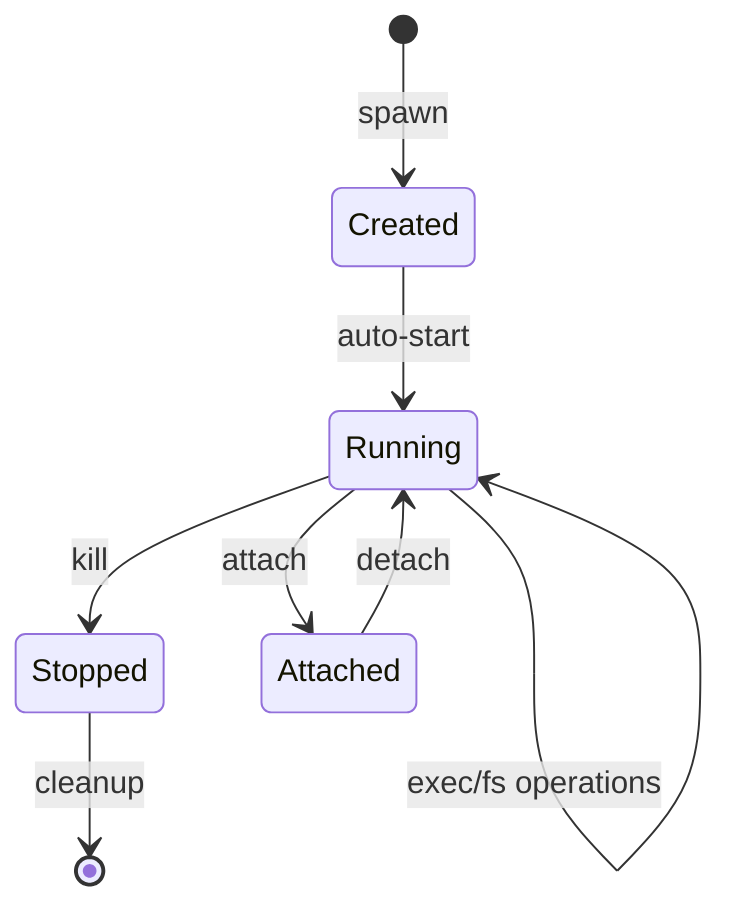

# Container Management

This guide covers container lifecycle management in MCP DevBench.

## Overview

MCP DevBench manages Docker containers through a high-level API that provides:

- **Secure isolation** - Each container runs with restricted capabilities
- **Resource limits** - CPU, memory, and PID constraints
- **Persistent storage** - Optional persistent volumes for containers
- **Automatic cleanup** - TTL-based expiration for ephemeral containers
- **Warm pool** - Pre-warmed containers for instant provisioning

## Spawning Containers

Create a new container using the `spawn` tool:

```python
{
  "image": "python:3.11-slim",
  "persistent": false,
  "alias": "my-workspace",
  "ttl_s": 3600
}
```

**Parameters:**

- `image` (required) - Docker image reference
- `persistent` - Whether container persists across server restarts (default: `false`)
- `alias` - User-friendly name for the container (optional)
- `ttl_s` - Time-to-live in seconds for ephemeral containers (optional)

**Returns:**

```python
{
  "container_id": "c_abc123...",
  "status": "running",
  "image": "python:3.11-slim",
  "workspace_path": "/workspace"
}
```

### Image Policy

Only images in the allow-list can be spawned. Configure via `MCP_ALLOWED_IMAGES`:

```bash
# Specific images only
MCP_ALLOWED_IMAGES=python:3.11-slim,node:18-slim,ubuntu:22.04

# Development: Allow all (NOT recommended for production)
MCP_ALLOWED_IMAGES=*
```

### Persistent vs Ephemeral

**Ephemeral containers** (default):
- Automatically cleaned up based on TTL
- Workspace data deleted when container is removed
- Best for temporary workspaces

**Persistent containers:**
- Survive server restarts
- Workspace data preserved
- Must be manually cleaned up
- Best for long-lived projects

## Attaching to Containers

Before executing commands or accessing files, attach your client session:

```python
{
  "target": "my-workspace",  # or use container_id
  "client_name": "claude",
  "session_id": "unique-session-id"
}
```

**Parameters:**

- `target` (required) - Container ID or alias
- `client_name` (required) - Name of the client (for auditing)
- `session_id` (required) - Unique session identifier

Multiple clients can attach to the same container concurrently.

## Listing Containers

Get a list of all containers:

```python
{
  "include_stopped": false
}
```

**Returns:**

```python
{
  "containers": [
    {
      "container_id": "c_abc123...",
      "alias": "my-workspace",
      "image": "python:3.11-slim",
      "status": "running",
      "created_at": "2024-01-15T10:30:00Z",
      "persistent": false,
      "expires_at": "2024-01-15T11:30:00Z"
    }
  ]
}
```

## Stopping Containers

Stop and remove a container:

```python
{
  "container_id": "c_abc123...",
  "force": true
}
```

**Parameters:**

- `container_id` (required) - Container to stop
- `force` - Force stop even if operations are running (default: `false`)

!!! warning
    Forcing stop will terminate all running executions immediately.

## Container Lifecycle



### States

- **Created** - Container exists but not started
- **Running** - Container is running and ready for operations
- **Attached** - Client session is attached
- **Stopped** - Container has been stopped
- **Removed** - Container and data deleted

## Warm Container Pool

MCP DevBench maintains a pool of pre-warmed containers for instant provisioning:

### How It Works

1. Pool maintains N containers in ready state
2. When client attaches, a warm container is assigned
3. Pool automatically refills to maintain size
4. Containers expire if unused for too long

### Configuration

```bash
# Enable warm pool
MCP_WARM_POOL_ENABLED=true

# Pool size
MCP_WARM_POOL_SIZE=5

# Image for warm containers
MCP_WARM_POOL_IMAGE=python:3.11-slim

# Refresh interval (seconds)
MCP_WARM_POOL_REFRESH_INTERVAL=300
```

### Using Warm Pool

Attach to a warm container:

```python
{
  "target": "warm-pool",
  "client_name": "claude",
  "session_id": "my-session"
}
```

This provides sub-second provisioning vs 5-10 seconds for cold start.

## Resource Management

### Resource Limits

All containers have default resource limits:

```bash
# Memory limit (MB)
MCP_CONTAINER_MEMORY_LIMIT=512

# CPU limit (cores)
MCP_CONTAINER_CPU_LIMIT=1.0

# Process limit
MCP_CONTAINER_PID_LIMIT=256
```

### Security Constraints

Containers run with:

- **Read-only root filesystem** - Only `/workspace` is writable
- **Dropped capabilities** - All Linux capabilities dropped
- **Non-root user** - Runs as UID 1000
- **No new privileges** - Cannot escalate privileges

See the [Security Guide](security.md) for details.

## Automatic Cleanup

### TTL-Based Cleanup

Ephemeral containers are automatically cleaned up when:

1. TTL expires (if specified)
2. Default TTL expires (if no TTL specified)
3. Server shutdown (graceful drain)

Configure cleanup:

```bash
# Enable cleanup
MCP_CLEANUP_ENABLED=true

# Cleanup interval
MCP_CLEANUP_INTERVAL=300

# Default TTL (seconds)
MCP_DEFAULT_CONTAINER_TTL=3600
```

### Manual Cleanup

Clean up specific containers:

```python
kill({
  "container_id": "c_abc123...",
  "force": true
})
```

### Cleanup on Startup

Reconcile state on server startup:

```bash
MCP_CLEANUP_ON_STARTUP=true
```

This removes orphaned containers and syncs database with Docker state.

## Best Practices

### Development Workflows

1. **Use aliases** - Makes containers easier to find
2. **Set TTLs** - Prevent orphaned containers
3. **Monitor metrics** - Track container count and usage
4. **Clean up regularly** - Don't let containers accumulate

### Production Deployments

1. **Use persistent containers** - For long-lived workspaces
2. **Enable warm pool** - Faster provisioning
3. **Monitor resource usage** - Watch CPU/memory/disk
4. **Set up alerts** - Container count, failed spawns
5. **Audit logs** - Track all container operations

## Troubleshooting

### Container Won't Start

Check Docker daemon:
```bash
docker ps
```

Check image exists:
```bash
docker images | grep your-image
```

Check logs:
```bash
docker logs container-id
```

### Out of Resources

Check Docker resources:
```bash
docker system df
```

Clean up unused resources:
```bash
docker system prune -a
```

### Containers Not Cleaned Up

Check cleanup configuration:
```bash
echo $MCP_CLEANUP_ENABLED
echo $MCP_CLEANUP_INTERVAL
```

Manually trigger cleanup or restart server.

## Next Steps

- **[Command Execution](execution.md)** - Run commands in containers
- **[Filesystem Operations](filesystem.md)** - Manage files and directories
- **[Security Guide](security.md)** - Understand security model
- **[Monitoring](monitoring.md)** - Track container health
