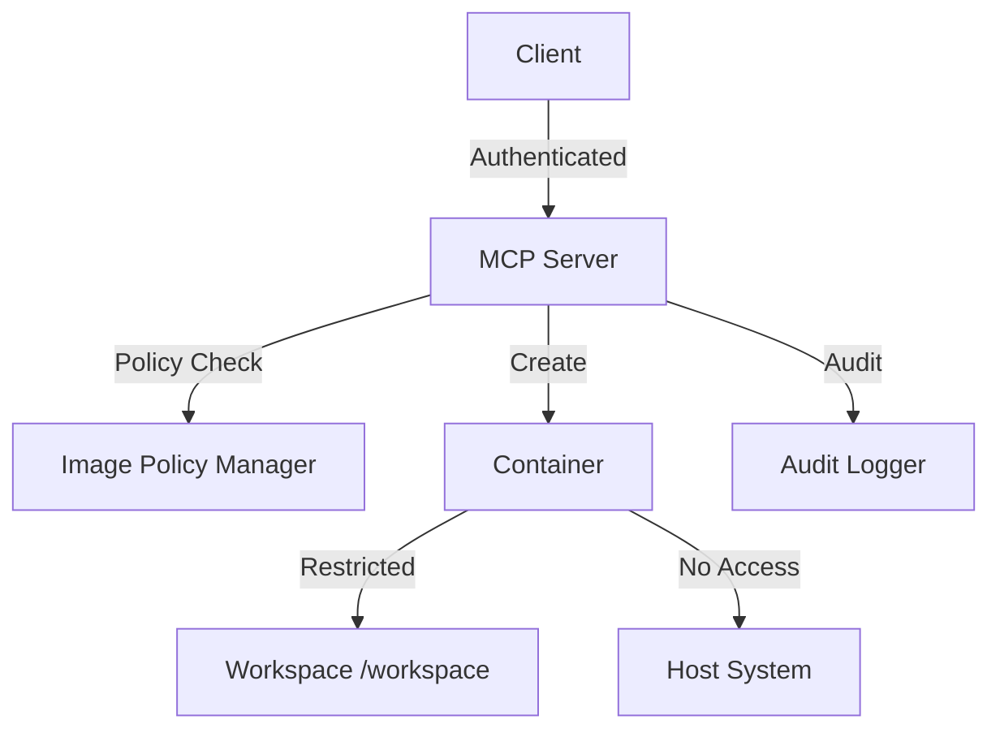

# Security

MCP DevBench is designed with security as a top priority. This guide explains the security model and best practices.

## Security Architecture



## Container Isolation

### Read-Only Root Filesystem

Containers run with read-only root filesystem:

```bash
MCP_CONTAINER_READ_ONLY_ROOTFS=true
```

Only `/workspace` is writable, preventing:
- System file modification
- Package installation in system directories
- Persistent malware

### Capability Dropping

All Linux capabilities are dropped:

```bash
MCP_CONTAINER_DROP_CAPABILITIES=true
```

Prevents containers from:
- Changing file ownership
- Loading kernel modules
- Accessing raw network sockets
- Binding to privileged ports

### Non-Root User

Containers run as non-root user (UID 1000):

```python
User: "1000:1000"
```

Prevents privilege escalation and limits system access.

### No New Privileges

Security option prevents privilege escalation:

```python
SecurityOpt: ["no-new-privileges:true"]
```

## Resource Limits

### Memory Limits

Default memory limit:

```bash
MCP_CONTAINER_MEMORY_LIMIT=512  # MB
```

Prevents:
- Memory exhaustion attacks
- Host out-of-memory
- Container affecting other containers

### CPU Limits

Default CPU limit:

```bash
MCP_CONTAINER_CPU_LIMIT=1.0  # cores
```

Prevents:
- CPU starvation
- Noisy neighbor problems
- Denial of service

### Process Limits

Default PID limit:

```bash
MCP_CONTAINER_PID_LIMIT=256
```

Prevents:
- Fork bombs
- Process table exhaustion
- Resource abuse

### Execution Limits

Command execution limits:

```bash
# Maximum concurrent executions per container
MCP_MAX_CONCURRENT_EXECS=4

# Maximum execution timeout
MCP_MAX_EXEC_TIMEOUT=3600  # seconds
```

## Network Isolation

### Network Mode

By default, containers have no network access:

```python
NetworkMode: "none"
```

For containers requiring network:

```bash
MCP_ALLOW_NETWORK=false  # Default
```

### Egress Control

When network is enabled, control egress:

```bash
# Allowed destinations (future feature)
MCP_NETWORK_ALLOWED_HOSTS=pypi.org,npmjs.com
```

## Image Policy

### Allow-List

Only explicitly allowed images can be spawned:

```bash
MCP_ALLOWED_IMAGES=python:3.11-slim,node:18-slim,ubuntu:22.04
```

Prevents:
- Malicious images
- Vulnerable images
- Unauthorized software

### Image Scanning (Planned)

Future feature will scan images for vulnerabilities:

```bash
MCP_IMAGE_SCANNING_ENABLED=true
MCP_IMAGE_SCAN_MAX_SEVERITY=HIGH
```

## Filesystem Security

### Path Validation

All paths validated before operations:

```python
MCP_VALIDATE_PATHS=true
```

Prevents:
- Directory traversal attacks
- Access to system files
- Symlink attacks

### Workspace Isolation

All operations restricted to `/workspace`:

```
✅ Allowed: /workspace/file.txt
❌ Rejected: /etc/passwd
❌ Rejected: ../../../etc/passwd
```

### File Size Limits

Maximum file size:

```bash
MCP_MAX_FILE_SIZE=100  # MB
```

Prevents:
- Disk exhaustion
- Memory exhaustion during reads
- DoS attacks

## Authentication

### Authentication Modes

Three authentication modes:

1. **None** (development only)
```bash
MCP_AUTH_MODE=none
```

2. **Bearer Token**
```bash
MCP_AUTH_MODE=bearer
MCP_AUTH_BEARER_TOKEN=your-secret-token
```

3. **OIDC** (recommended for production)
```bash
MCP_AUTH_MODE=oidc
MCP_OAUTH_CONFIG_URL=https://auth.example.com/.well-known/openid-configuration
MCP_OAUTH_CLIENT_ID=mcp-devbench
MCP_OAUTH_CLIENT_SECRET=your-client-secret
```

!!! danger
    Never use `none` authentication in production!

### Token Management

For bearer authentication:

1. Generate strong tokens (32+ bytes)
2. Rotate regularly
3. Store securely (secrets manager)
4. Use HTTPS in production

## Audit Logging

### Audit Trail

All operations are logged:

```bash
MCP_AUDIT_ENABLED=true
MCP_AUDIT_LOG_FILE=/var/log/mcp-devbench/audit.log
```

Audit log includes:
- Client identity
- Operation type
- Container ID
- Timestamp
- Operation result

### Log Format

Structured JSON logs:

```json
{
  "timestamp": "2024-01-15T10:30:00Z",
  "event_type": "container.spawn",
  "client_name": "claude",
  "session_id": "session-123",
  "container_id": "c_abc123",
  "image": "python:3.11-slim",
  "result": "success"
}
```

### Log Retention

Configure log retention:

```bash
# Rotate logs daily
MCP_AUDIT_LOG_ROTATION=daily

# Keep 30 days
MCP_AUDIT_LOG_RETENTION_DAYS=30
```

## Security Best Practices

### Deployment

1. **Always use authentication** in production
2. **Enable audit logging** for compliance
3. **Use HTTPS** for HTTP transport
4. **Restrict Docker socket** access
5. **Run as non-root user** on host
6. **Keep images updated** regularly
7. **Monitor metrics** for anomalies

### Image Selection

1. **Use minimal images** (alpine, slim)
2. **Pin to specific versions** with digests
3. **Scan images** for vulnerabilities
4. **Avoid latest tags** in production
5. **Build custom images** for specific needs

### Configuration

1. **Set appropriate limits** for resources
2. **Enable all security options**
3. **Restrict network access** by default
4. **Use secrets management** for tokens
5. **Review configurations** regularly

### Monitoring

1. **Track failed authentications**
2. **Alert on suspicious activity**
3. **Monitor resource usage**
4. **Review audit logs** regularly
5. **Set up alerting** for anomalies

## Common Threats

### Container Escape

**Threat:** Attacker breaks out of container to host.

**Mitigations:**
- Read-only rootfs
- Dropped capabilities
- Non-root user
- No new privileges
- Seccomp profiles

### Resource Exhaustion

**Threat:** Container consumes all resources.

**Mitigations:**
- Memory limits
- CPU limits
- PID limits
- Execution timeouts
- Disk quotas

### Data Exfiltration

**Threat:** Sensitive data leaked from containers.

**Mitigations:**
- Network isolation
- Path validation
- Audit logging
- File size limits
- Content filtering

### Malicious Images

**Threat:** Compromised Docker images.

**Mitigations:**
- Image allow-list
- Image scanning (planned)
- Version pinning
- Private registries
- Supply chain security

## Incident Response

### Detection

Monitor for:
- Failed authentication attempts
- Unusual resource usage
- Access to sensitive paths
- Network connections (if enabled)
- Container escape attempts

### Response

1. **Isolate** affected containers
2. **Review** audit logs
3. **Analyze** for compromise indicators
4. **Remediate** vulnerabilities
5. **Document** incident
6. **Update** security policies

## Compliance

### Standards

MCP DevBench supports compliance with:
- SOC 2
- ISO 27001
- PCI DSS (for appropriate use cases)
- GDPR (with proper configuration)

### Audit Requirements

- **Audit logging** enabled
- **Authentication** required
- **Access controls** enforced
- **Data retention** configured
- **Regular reviews** conducted

## Security Roadmap

Planned security features:

1. **Image vulnerability scanning** - Trivy integration
2. **Network policies** - Fine-grained egress control
3. **Security policies** - Per-container security configuration
4. **Runtime protection** - Falco integration
5. **Secrets management** - Vault integration

## Reporting Security Issues

Found a security vulnerability?

1. **Do NOT** open a public issue
2. Email security@mcp-devbench.example (if available)
3. Or use GitHub Security Advisories
4. Include detailed reproduction steps
5. We aim to respond within 48 hours

## Next Steps

- **[Container Management](containers.md)** - Container lifecycle
- **[Monitoring](monitoring.md)** - Track security metrics
- **[Operations](../operations/deployment.md)** - Secure deployment
