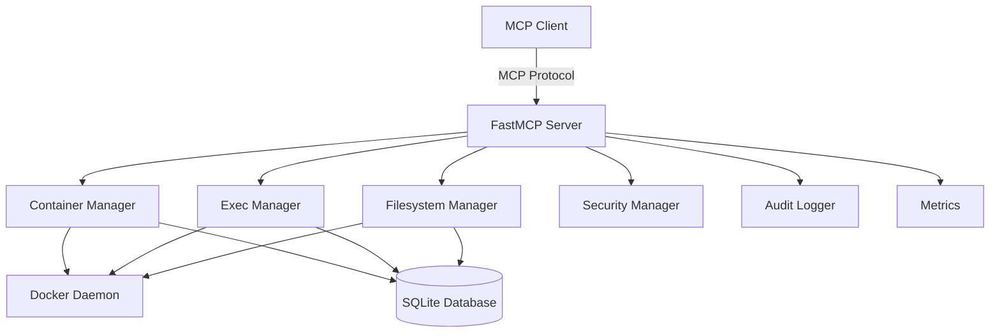

# MCP DevBench

> **Production-ready Docker container management server implementing the Model Context Protocol (MCP)**

MCP DevBench provides isolated, persistent development workspaces through a secure, audited, and observable container management API. Built for AI assistants like Claude, it enables safe command execution and filesystem operations in Docker containers.

## ✨ Features

### Core Capabilities

- 🚀 **Container Lifecycle Management** - Create, start, stop, and remove Docker containers with fine-grained control
- 📁 **Secure Filesystem Operations** - Read, write, delete files with path validation and ETag-based concurrency control
- ⚡ **Async Command Execution** - Non-blocking execution with streaming output and timeout handling
- 🔐 **Enterprise Security** - Capability dropping, read-only rootfs, resource limits, and comprehensive audit logging
- 📊 **Production Observability** - Prometheus metrics, structured JSON logging, and system health monitoring

### Advanced Features

- **Warm Container Pool** - Sub-second container provisioning for instant attach
- **Graceful Shutdown** - Drain active operations before server termination
- **Automatic Recovery** - Reconciles Docker state with database on startup
- **Image Policy Enforcement** - Allow-list validation with digest pinning
- **Multi-Transport Support** - stdio, SSE, or HTTP-based MCP transports
- **Flexible Authentication** - None, Bearer token, or OIDC authentication modes

## 🚀 Quick Start

### Prerequisites

- Python 3.11+
- Docker Engine
- [uv](https://github.com/astral-sh/uv) package manager

### Installation

```bash
# Install uv
pip install uv

# Clone the repository
git clone https://github.com/pvliesdonk/mcp-devbench.git
cd mcp-devbench

# Install dependencies
uv sync
```

### Running the Server

**Development Mode (stdio)**
```bash
uv run python -m mcp_devbench.server
```

**Production Mode (HTTP)**
```bash
export MCP_TRANSPORT_MODE=streamable-http
export MCP_HOST=0.0.0.0
export MCP_PORT=8000
uv run python -m mcp_devbench.server
```

**Using Docker**
```bash
docker build -t mcp-devbench .
docker run -v /var/run/docker.sock:/var/run/docker.sock \
  -p 8000:8000 \
  -e MCP_TRANSPORT_MODE=streamable-http \
  mcp-devbench
```

**Using Docker Compose**
```bash
docker-compose up -d
```

## 📚 Documentation

- **[Getting Started](getting-started/installation.md)** - Installation and quick start guide
- **[User Guide](guide/containers.md)** - Learn how to use MCP DevBench
- **[API Reference](api/overview.md)** - Complete API documentation
- **[Operations](operations/deployment.md)** - Deployment and operational guides
- **[Development](development/contributing.md)** - Contributing to MCP DevBench

## 🏗️ Architecture



## 🔐 Security

MCP DevBench is designed with security as a top priority:

- **Isolated Containers** - Each workspace runs in its own Docker container
- **Capability Dropping** - Containers run with minimal Linux capabilities
- **Read-only Rootfs** - Container root filesystem is read-only
- **Resource Limits** - CPU, memory, and PID limits enforced
- **Path Validation** - All filesystem operations validated against workspace directory
- **Audit Logging** - All operations logged with structured metadata
- **Image Policy** - Only allowed images can be spawned

See the [Security Guide](guide/security.md) for more details.

## 📊 Observability

Built-in observability features:

- **Prometheus Metrics** - Container count, execution time, filesystem operations
- **Structured Logging** - JSON-formatted logs with correlation IDs
- **Health Checks** - Ready and live endpoints for orchestration
- **Audit Trail** - Complete history of all operations

See the [Monitoring Guide](operations/monitoring.md) for more details.

## 🤝 Contributing

We welcome contributions! Please see our [Contributing Guide](development/contributing.md) for details.

## 📄 License

This project is licensed under the MIT License - see the [LICENSE](about/license.md) file for details.

## 🔗 Links

- **GitHub Repository**: [pvliesdonk/mcp-devbench](https://github.com/pvliesdonk/mcp-devbench)
- **Issue Tracker**: [GitHub Issues](https://github.com/pvliesdonk/mcp-devbench/issues)
- **Discussions**: [GitHub Discussions](https://github.com/pvliesdonk/mcp-devbench/discussions)
